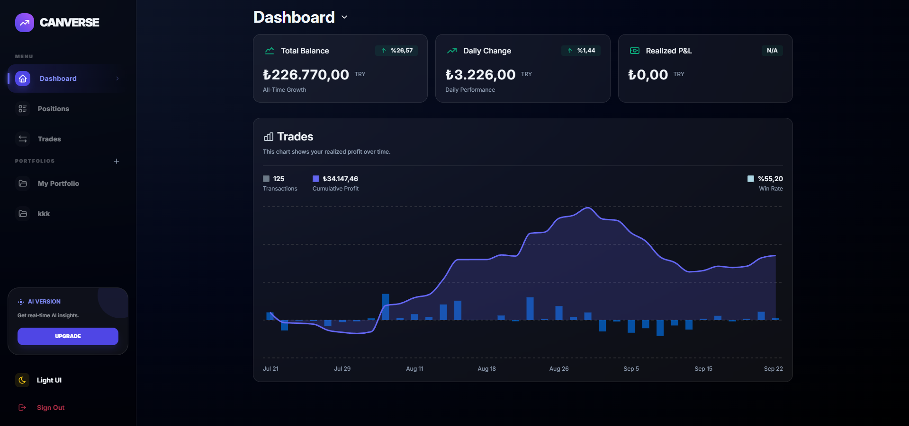
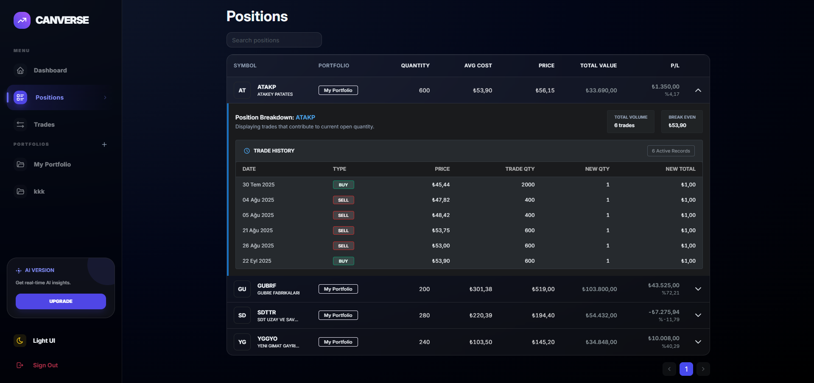
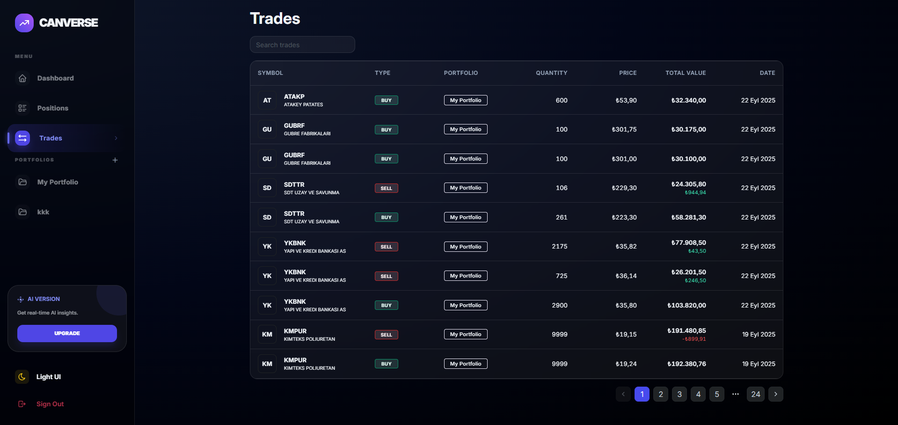
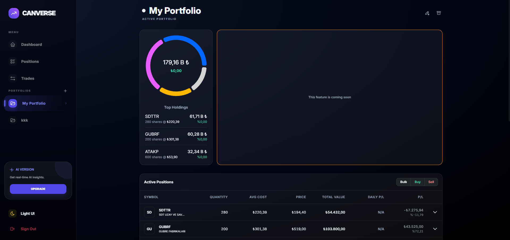

# Portfolio & Analytics Platform

A personal finance and investment tracking platform that allows users to record their trades and analyze performance
across multiple portfolios and dashboards.

This project is actively evolving and focuses on real-world architecture, deployment, and scalability practices.

The platform is continuously being refactored to improve code quality,
maintainability, and user experience.

---

## 🚀 Features

- Authentication
    - Google OAuth login
    - Custom email/password login

- Trade Management
    - Buy / Sell transaction tracking
    - Support for multiple instruments (stocks, crypto, metals, etc.)
    - Support for multiple currencies
    - Multi-portfolio support

- Analytics
    - Total balance tracking
    - Daily change calculation
    - Realized P&L (monthly)
    - Cumulative and individual trade profit/loss charts
    - Performance dashboards linked to portfolios

- UI / UX (still refactoring)
    - Light / Dark mode
    - Responsive interface
    - Multiple dashboard views

- Infrastructure
    - Dockerized deployment
    - Automated builds via Dokploy
    - Environment-based configuration
    - Secure secrets management

---

## 🛠️ Tech Stack

### Backend

- Java
- Spring Boot
- Spring Security
- JPA / Hibernate
- MyBatis (native queries)
- Flyway (database migrations)

### Frontend (under active modernization)

- Vite + React
- TypeScript
- Mantine UI with custom styles
- TanStack Router (file-based)
- TanStack Query
- OpenAPI Fetch with generated API clients + TanStack Query integration
- Zustand
- Biome.js (code formatting and linting)

### Database

- PostgreSQL

### DevOps

- Docker
- Dokploy
- GitHub automated builds via Dokploy

---

## 📊 Project Status

This project is under active development.

The initial focus was on delivering core functionality.
As the system matured, structured database migrations and infrastructure improvements were introduced.

New features and architectural refinements are continuously being added.

### Live Demo

A live demo of the platform is available at: [https://borsa.canverse.dev](https://borsa.canverse.dev)

- Demo Account
    - Email: demo2@gmail.com
    - Password: 12345678

### Screenshots

